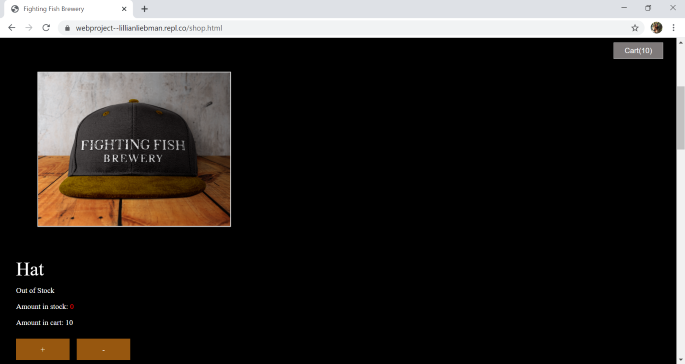

The Fighting Fish Brewery website was a group project created for my Internet Tools and Web Design class.
------

The website includes the following five pages:
1. Home
1. About
1. Our Beers
1. Events
1. Shop

The whole project implemented HTML, CSS, JavaScript, Vue.js, AJAX, jQuery, and Bootstrap.

Check out the entire website [here](https://dnagelcs.github.io/FightingFishBreweryWebsite/)

--------

I worked on the shop page using the following features of Vue.js:
* Component
* Two-way binding
* Conditional rendering
* Computed properties
* Style changes based on data

